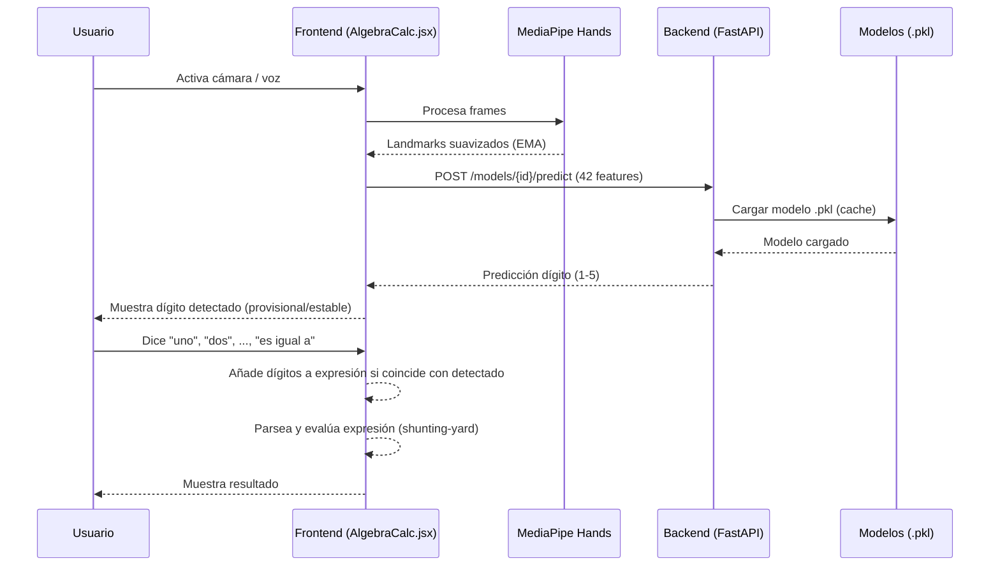
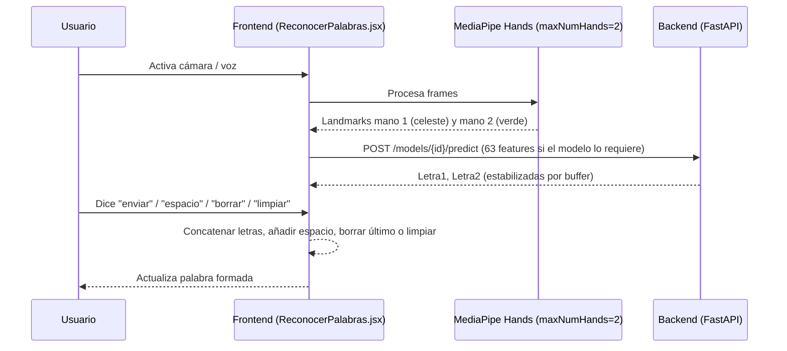
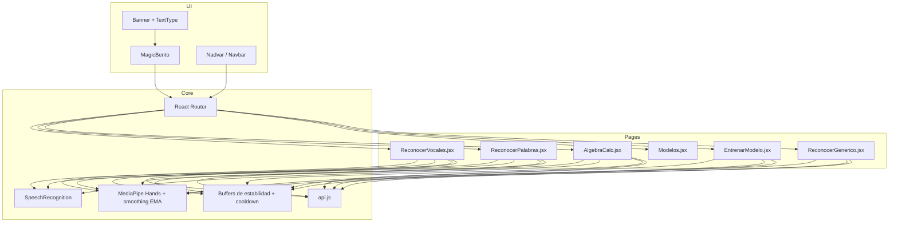
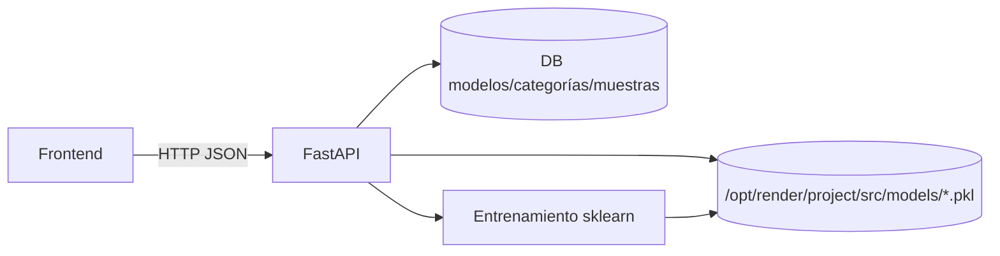
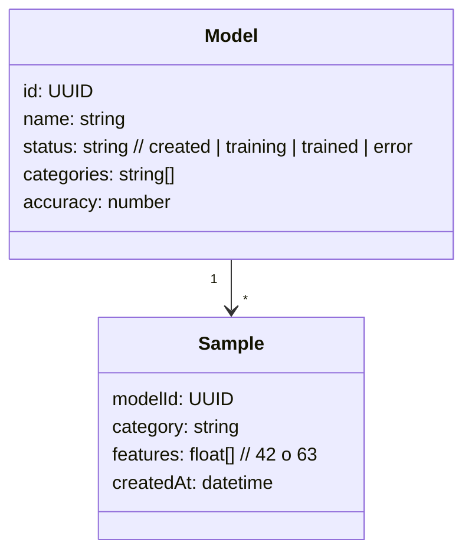
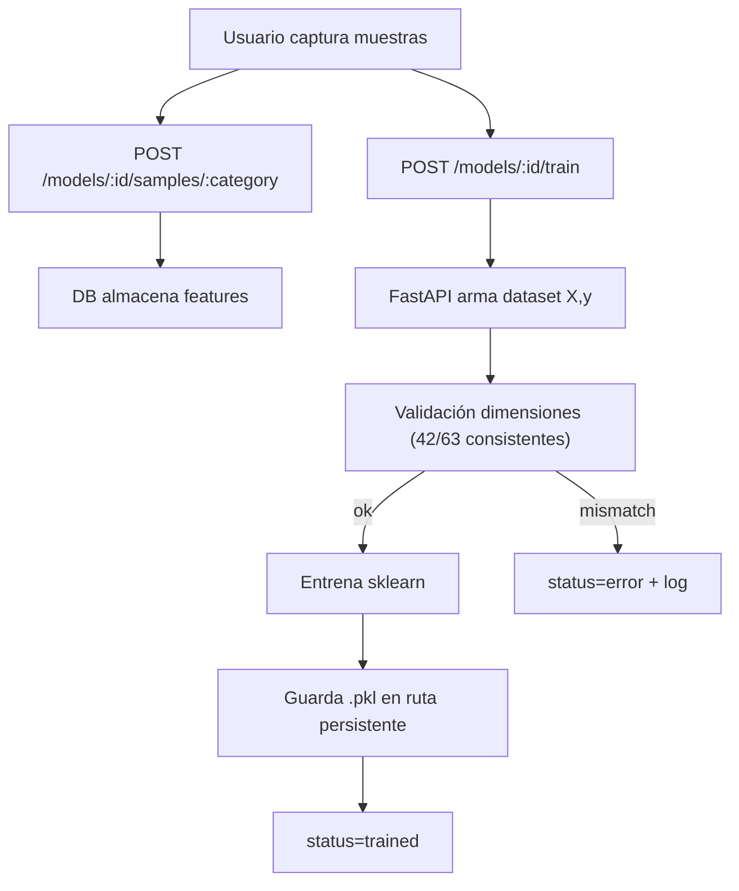

## Diagramas del Proyecto CodeHandV2

Este documento resume, a alto nivel, el flujo, la arquitectura y las interacciones principales del sistema (frontend React con MediaPipe + backend FastAPI + almacenamiento de modelos). Los diagramas están en formato Mermaid para fácil visualización.

### 1) Diagrama de Flujo (alto nivel)

```mermaid
flowchart LR
  A["Usuario"] -->|Navega / interactúa| B["Frontend React"]
  B -->|Video de cámara| C["MediaPipe Hands"]
  C -->|Landmarks (42/63)| D["Lógica de Página"]
  D -->|/models/:id/predict| E["Backend FastAPI"]
  E -->|Carga Modelo .pkl| F["Cache/Disco Persistente"]
  E -->|Predicción| D
  D -->|Actualiza UI / Voz| B
  B -->|Rutas (Router)| G["Pages:<br/>ReconocerVocales<br/>ReconocerPalabras<br/>AlgebraCalc<br/>Modelos<br/>EntrenarModelo<br/>ReconocerGenerico"]
```

Notas:
- La app utiliza 42 (x,y) por defecto; algunos módulos específicos pueden usar 63 (x,y,z) si el modelo fue entrenado así.
- La persistencia de modelos usa archivos `.pkl` en el backend. Si falta el archivo, se entrena nuevamente.

### 2) Diagrama de Secuencia: Reconocimiento en AlgebraCalc



### 3) Diagrama de Secuencia: Dos manos en ReconocerPalabras



### 4) Arquitectura Lógica (Frontend)



### 5) Arquitectura Backend (alto nivel)



Endpoints clave:
- GET /models
- POST /models/create
- POST /models/{id}/train
- POST /models/{id}/predict
- POST /models/{id}/samples/{category}
- POST /models/{id}/import-csv
- DELETE /models/{id}

### 6) Modelo de Datos (simplificado)



### 7) Flujo de Entrenamiento



### 8) Notas de Implementación
- Suavizado EMA de landmarks y buffers de estabilidad para reducir “salto”.
- Reconocimiento por voz: comandos por página y asoc. de dígitos/palabras.
- Rutas dinámicas: `Modelos.jsx` decide si ir a `AlgebraCalc`, `ReconocerVocales` o `ReconocerGenerico` según nombre/categorías.
- Persistencia: si falta `.pkl`, reentrenar o marcar 503 para reintentar.

### 9) Cómo visualizar Mermaid
- En GitHub/VSCode con extensiones Mermaid.
- O usa `https://mermaid.live` para pegar los bloques y renderizarlos.


